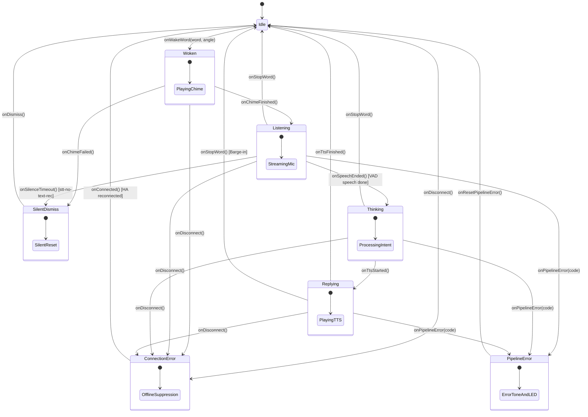

# nim-esphome-satellite

**`nim-esphome-satellite`** is a compile-time verified voice satellite state machine for [ESPHome](https://esphome.io) devices (such as ReSpeaker XVF3800 and Home Assistant Voice PE), built using [`nim-esphome`](https://github.com/axiomantic/nim-esphome) and [`nim-typestates`](https://github.com/elijahr/nim-typestates).

It moves voice satellite state management entirely onto the ESP32 device, eliminating split-brain race conditions between the server and the satellite while enforcing invariant safety at compile time.

---

## Why Typestates for Voice Satellites?

In conventional ESPHome voice satellites, state is split across asynchronous network callbacks, C++ lambdas, and Home Assistant automations. This creates notorious edge cases:
- **`Stop` word clobbering**: False triggers on ambient noise stop the satellite while it is idling.
- **Premature chime & VAD clipping**: Audio chimes play while the microphone is streaming, causing `stt-no-text-recognized`.
- **Hangs on silence**: Inaudible speech or silence enters a blocking error-delay loop.

**`nim-esphome-satellite` eliminates these at compile time**:
1. **Illegal transitions fail compilation**: Code cannot end speech unless in `Listening`, cannot start TTS unless in `Thinking`, and cannot trigger wake words when offline.
2. **`Stop` is strictly bounded**: The `Stop` command can only interrupt during `Listening`, `Thinking`, or `Replying` (barge-in). It cannot exist in `Idle`.
3. **Strict Chime Serialization**: Microphone streaming cannot be entered until chime playback completes.

---

## State Machine Architecture



---

## Granular Error Handling

Unlike monolithic state machines with a single `Error` state, `nim-esphome-satellite` models three distinct failure modes:

| Error Typestate | Trigger | Hardware & UX Behavior |
|---|---|---|
| **`SilentDismiss`** | Silence (`stt-no-text-recognized`), duplicate wake word. | **Silent instant reset**. No error buzzer, no red blinking. Satellite immediately returns to `Idle`. |
| **`PipelineError`** | Intent parsing error, TTS streaming socket failure. | Plays error tone, pulses red LEDs, unlocks beamformer, and resets to `Idle`. |
| **`ConnectionError`**| Home Assistant server down, WiFi dropped. | Persistent warning LED pattern. **Wake word detection is suppressed** at compile time. |

---

## Usage in ESPHome

Add [`nim-esphome`](https://github.com/axiomantic/nim-esphome) to your ESPHome configuration:

```yaml
external_components:
  - source:
      type: git
      url: https://github.com/axiomantic/nim-esphome
    components: [nim]

nim:
  source: path/to/nim-esphome-satellite/src/nim_esphome_satellite.nim
  nimble_paths:
    - path/to/nim-typestates/src
```

In your ESPHome voice assistant events:
```yaml
voice_assistant:
  on_start:
    - lambda: |-
        nim_satellite_chime_done(true);
  on_stt_vad_end:
    - lambda: |-
        nim_satellite_speech_ended();
  on_tts_start:
    - lambda: |-
        nim_satellite_tts_start();
  on_tts_end:
    - lambda: |-
        nim_satellite_tts_end();
  on_error:
    - lambda: |-
        nim_satellite_error(code.c_str());
  on_client_connected:
    - lambda: |-
        nim_satellite_connected();
  on_client_disconnected:
    - lambda: |-
        nim_satellite_disconnected();
```

---

## Testing

Run the test suite locally (on macOS or Linux) with zero hardware attached:

```bash
nim c -r tests/test_fsm.nim
```

Includes tests for happy path lifecycles, barge-in interruptions, granular error recovery, and compile-time negative invariant enforcement (`not compiles(...)`).

---

## License

MIT © [Elijah Rust](https://github.com/elijahr)
