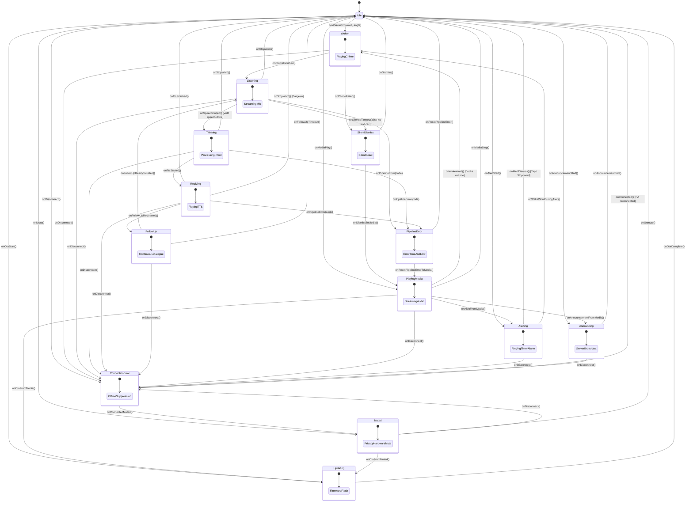

# esphome-satellite

[](https://github.com/axiomantic/esphome-satellite/actions/workflows/ci.yml)
[](https://opensource.org/licenses/MIT)

**`esphome-satellite`** is an on-device state supervisor for [ESPHome](https://esphome.io) and [Home Assistant](https://www.home-assistant.io/) voice satellites (including Seeed ReSpeaker XVF3800 and Home Assistant Voice PE), built with [`nim-esphome`](https://github.com/axiomantic/nim-esphome) and [`nim-typestates`](https://github.com/elijahr/nim-typestates).

Standard ESPHome voice setups rely on loose asynchronous network events and C++ callbacks that frequently fall out of sync—causing wake chimes to clip microphones, ambient TV noise to trigger false "stop" commands while idle, volume ducking to get orphaned, or satellites to freeze when the server drops connection.

`esphome-satellite` moves state coordination directly onto the ESP32 microcontroller, enforcing strict rules so your audio hardware and the Home Assistant server always stay in lockstep:

- **Self-Hearing Protection**: Discards microphone input until the wake chime has completely finished, eliminating false silence errors caused by the speaker clipping the mic.
- **Context-Aware Wake Words**: Stop words are strictly ignored when the device is idle, eliminating phantom cancellations from background TV or conversation.
- **Fail-Safe Media & State Recovery**: If Home Assistant drops connection or a pipeline errors mid-stream, media automatically un-ducks and the device safely resets to idle instead of freezing.
- **Compile-Time Verified**: Every valid state transition is proven at compile time—dead ends, impossible states, and race conditions are caught before firmware is ever flashed.
- **Drop-In Integration**: Integrates with standard ESPHome voice assistant pipelines and hardware.

---

### Quick Install

#### Option 1: In-Browser Web Installer (Recommended)

Connect your ESP32 device via USB and flash pre-compiled firmware directly from Chrome or Edge:

[](https://axiomantic.github.io/esphome-satellite/)

#### Option 2: ESPHome YAML Package

If you build firmware with ESPHome CLI or the ESPHome Dashboard, add the remote package to your device configuration:

```yaml
packages:
  satellite: github://axiomantic/esphome-satellite/packages/respeaker_xvf3800.yaml
```

---

### Post-Installation Setup

Follow these steps right after flashing to connect the satellite to your network and Home Assistant:

#### Step 1: Power-Cycle the Board (Required on ESP32-S3)

> [!IMPORTANT]
> **ESP32-S3 Native USB Bootloader Quirk:**
> Devices using the ESP32-S3 native USB-Serial-JTAG controller (such as the Seeed ReSpeaker Lite XVF3800) remain halted in the ROM Bootloader after flashing or erasing via WebSerial. Because native USB lacks hardware RTS/DTR auto-reset circuits, the browser cannot trigger a cold boot.
>
> **You must physically unplug and reconnect the USB-C cable** (or tap the **RST** button on the board) right after flashing!
> 
> *If you attempt to configure Wi-Fi before power-cycling, the installer will report `An error occurred. Improv Wi-Fi Serial not detected` because the firmware has not booted yet.*

#### Step 2: Connect to Wi-Fi

Once the board has rebooted into ESPHome, connect using either method:

- **Method A: USB Serial (Improv Wi-Fi)**:
  On the [Web Installer page](https://axiomantic.github.io/esphome-satellite/), click the **Configure Wi-Fi** button. The browser will discover the device via Improv Serial and prompt you to select your Wi-Fi network and enter your password.
- **Method B: Fallback Wi-Fi Hotspot**:
  On your phone or laptop, open your Wi-Fi settings and connect to the temporary open access point named **`Satellite Fallback Hotspot`**. The captive portal will open automatically at `http://192.168.4.1` where you can enter your Wi-Fi credentials.

#### Step 3: Adopt in Home Assistant

1. In Home Assistant, open **Settings > Devices & Services**.
2. Your satellite will automatically appear highlighted at the top under **Discovered** as **Voice Satellite** (e.g., `Voice Satellite ba2c6c` or `Voice Satellite 46cbe8`).
3. Click **Configure**, then click **Submit**.
4. Assign the device to an area.

> [!TIP]
> **No Encryption Key Required & Troubleshooting "Encryption Key" Prompt:**
>
> - **Zero Encryption Key**: `esphome-satellite` connects via standard ESPHome API without requiring an encryption key (`noise_psk: ""`).
> - **Why Home Assistant might ask for an "Encryption key"**:
>   Brand-new Seeed ReSpeaker boards ship with Seeed's proprietary encrypted ESPHome firmware pre-installed. If Home Assistant discovered the board before it was erased and flashed, Home Assistant created an in-memory discovery session marked with `noise_required: true`. In Home Assistant's schema, this makes the Encryption Key field mandatory—submitting a blank field is rejected with *"not all required fields are filled in"*.
> - **How to Solve in 10 Seconds (Direct Manual Add)**:
>   1. Cancel or close the prompt.
>   2. In Home Assistant, go to **Settings > Devices & Services > Add Integration > ESPHome**.
>   3. In **Host**, enter the device IP (or `esphome-satellite-<mac>.local`) and port `6053`.
>   4. Click **Submit**—Home Assistant connects immediately with zero prompts for an encryption key!
> - **Clear Stale Discovery Cache**: Alternatively, click **Ignore** on the discovered card and restart Home Assistant Core (**Developer Tools > YAML > Restart**) to flush the cached discovery session.
> - **Clean Factory Erase**: When flashing a brand-new board from Seeed for the first time, always select **"Erase device"** in the Web Installer so all factory NVS encryption tokens and partitions are completely wiped.

#### Step 4: Configure Multi-Assistant Pipelines & Audio Presets

1. In Home Assistant, navigate to **Settings > Voice Assistants**.
2. Create or verify your voice assistant pipelines (for example, a general smart home pipeline, a local Ollama LLM persona like *Mark Twain*, or a specialized assistant like *Jarvis*).
3. Navigate to **Settings > Devices & Services > ESPHome** and click on your satellite device:
   - **Assistant (Slot 1)**: Select your primary pipeline (e.g., *Mark Twain*).
   - **Wake word (Slot 1)**: Select which wake word triggers Slot 1 (e.g., *Mr. Clemens*).
   - **Assistant 2 (Slot 2)**: Select your secondary pipeline (e.g., *Jarvis* or *Home Assistant*).
   - **Wake word 2 (Slot 2)**: Select which wake word triggers Slot 2 (e.g., *Okay Nabu* or your uploaded custom model).
4. On the device card, customize your audio feedback across 17 pre-compiled acoustic themes:
   - **Wake Chime**: *Bell Ping*, *Modern Chime*, *Crystal Glass*, *Warm Kalimba*, *Meditation Bell*, *Marimba*, *Subtle Beep*, *Bamboo Chime*, *Tibetan Bowl*, *Acoustic Harp*, *Woodblock*, *Ceramic Bell*, *Neon Shimmer*, *Prism Ping*, *Cyber Bloom*, *Quantum Beep*, *Aero Chime*, or *Silent*.
   - **Processing Sound**: *Spinner*, *Pulse*, *Sonar*, *Tick*, *Typewriter*, *Clockwork* (seamless zero-gap loop), *Water Droplets*, *Raindrops*, *Forest Stream*, *Campfire Ember*, *Shishi-Odoshi*, *Soft Footsteps*, *Radar Ping*, *Data Crunch*, *Telemetry Blip*, *Quantum Flux*, *Retro Terminal*, or *Silent*.
   - **Cancel Sound**: *Match Wake Chime*, any of the 17 themed cancel resolves, or *Silent*.
   - **Wake Word Sensitivity**: *Slightly sensitive*, *Moderately sensitive*, or *Very sensitive*.

> **Manual / Source Builds**: See the full [**Integration Guide for ESPHome**](#integration-guide-for-esphome) below for custom YAML overrides, external component configuration, and C ABI bridge bindings.

---

## Table of Contents

- [Quick Install](#quick-install)
- [Post-Installation Setup](#post-installation-setup)
- [Multi-Wake-Word to Multi-Assistant Pipeline Mapping](#multi-wake-word-to-multi-assistant-pipeline-mapping)
- [Real-Time Audio DSP & Speech Optimization](#real-time-audio-dsp--speech-optimization)
- [Discrete Partition Flashing & NVS State Preservation](#discrete-partition-flashing--nvs-state-preservation)
- [The Voice Satellite Race Condition Problem](#the-voice-satellite-race-condition-problem)
- [How Compile-Time Typestates Solve It](#how-compile-time-typestates-solve-it)
- [State Machine Architecture](#state-machine-architecture)
- [Granular Error Handling](#granular-error-handling)
- [Extended Lifecycle States](#extended-lifecycle-states)
- [Audio Feedback, Processing Loops & Cancel Sounds](#audio-feedback-processing-loops--cancel-sounds)
- [In-Browser Audio Transcoding & WebSerial Diagnostics](#in-browser-audio-transcoding--webserial-diagnostics)
- [Home Assistant Surface Controls & Entities](#home-assistant-surface-controls--entities)
- [Integration Guide for ESPHome](#integration-guide-for-esphome)
  - [Step 1: Include External Components](#step-1-include-external-components)
  - [Step 2: Add the C Bridge Header](#step-2-add-the-c-bridge-header)
  - [Step 3: Connect Voice Assistant & Extended Event Hooks](#step-3-connect-voice-assistant--extended-event-hooks)
  - [Step 4: (Alternative) Using the Drop-in Package](#step-4-alternative-using-the-drop-in-package)
- [Supported Hardware](#supported-hardware)
- [Local Host Testing](#local-host-testing)
- [Project Layout](#project-layout)
- [Changelog](#changelog)
---

## Multi-Wake-Word to Multi-Assistant Pipeline Mapping

In modern Home Assistant voice environments, a single satellite device often needs to address multiple distinct personas, languages, or language models. For instance:
- *"Mr. Clemens"* can invoke a specialized, literary Mark Twain Ollama LLM persona.
- *"Okay Nabu"* can invoke the fast local Home Assistant pipeline for home automation commands.
- *"Hey Jarvis"* or a custom trained model can invoke an uncensored cloud conversational pipeline.

### How On-Device Concurrent Multi-Wake-Word Works
`esphome-satellite` harnesses the ESP32-S3 vector instructions and hardware neural network accelerator to evaluate up to **3 wake word models concurrently in real time**.

1. **Model Advertisement**: When the satellite connects to Home Assistant over the encrypted Native API, the firmware exposes all available on-device models (*Mr. Clemens*, *Okay Nabu*, plus any custom models loaded from dedicated flash partitions).
2. **Dual-Assistant Configuration**: In the Home Assistant device panel, Home Assistant maps these models into dual-assistant slots:
   - **Assistant (Slot 1)**: Maps your primary pipeline (e.g. *Mark Twain*) to its trigger wake word (e.g. *Mr. Clemens*).
   - **Assistant 2 (Slot 2)**: Maps your secondary pipeline (e.g. *Jarvis* or *Home Assistant*) to its trigger wake word (e.g. *Okay Nabu*).
3. **Zero-Latency Routing**: When speech is detected, the on-device microWakeWord engine identifies which specific wake word was matched and transmits the recognized phrase (`wake_word_phrase`) directly inside the `VoiceAssistantRequest` packet.
4. **Deterministic Server Dispatch**: Home Assistant inspects the incoming phrase and automatically dispatches the audio stream to the exact pipeline bound to that wake word slot. No complex automations, blueprint scripts, or server-side audio rerouting required.

### Dynamic Partition Loader for Custom Models
Using [`src/wake_partition_loader.nim`](src/wake_partition_loader.nim), users can flash up to 3 custom microWakeWord `.tflite` models into dedicated flash partitions (`wake_model`, `wake_model_2`, `wake_model_3` at `0x510000`, `0x550000`, `0x590000`). At boot time, the partition loader validates 64-byte `WAKE` headers, extracts tensor arena sizes and probability cutoffs, memory-maps the weights directly from SPI flash (avoiding heap allocation), and dynamically registers them into the active detection pool.

---

## Real-Time Audio DSP & Speech Optimization

Small voice satellites typically operate on compact 1W to 2W onboard speakers driven by miniature Class-D amplifiers. These drivers have narrow dynamic ranges and clip aggressively when driven with uncompressed text-to-speech audio.

`esphome-satellite` implements a real-time, zero-allocation audio DSP pipeline written in Nim ([`src/audio_dsp.nim`](src/audio_dsp.nim)) that runs on the ESP32 CPU directly on audio buffers before I2S DMA transmission:

### 1. Dynamic Range Compression
- **Threshold**: `-14.0 dBFS`
- **Compression Ratio**: `3:1`
- **Envelope Follower**: Smooth ballistic tracking with a `5ms` attack time and a `100ms` release time.

Signals above `-14 dBFS` undergo smooth gain reduction, preventing loud passages and transient voice bursts from overpowering the amplifier or driving the speaker cone into physical distortion.

### 2. Dialogue Makeup Boost
- **Makeup Gain**: `+5.0 dB`

Speech synthesis often includes subtle whispers, breath sounds, and soft cadence drops. A static `+5.0 dB` makeup boost raises quiet vocal passages, ensuring clarity and intelligibility across the room even at lower overall volume levels.

### 3. Soft-Knee Rational Limiting
A rational transfer limiter clamps any remaining peak overshoots above `-1.0 dBFS` using a smooth non-linear knee:
```text
limiter(x) = x / (1.0 + |x|)
```
This guarantees that digital audio values never wrap or hard-clip, providing warm, distortion-free playback even when driving the speaker at maximum volume.

---

## Discrete Partition Flashing & NVS State Preservation

Standard ESPHome web installations flash a single merged `firmware.factory.bin` starting at flash address `0x0` and extending across `~1.88 MB`. Because this contiguous binary covers the Non-Volatile Storage (NVS) address space (`0x9000` to `0xE000`) with blank `0xFF` padding bytes, flashing a firmware update traditionally wiped all saved device state—forcing users to re-enter Wi-Fi credentials, re-select wake words, and reconfigure volume levels after every release.

`esphome-satellite` implements **discrete partition flashing**:

| Binary Component | Flash Offset | Size | Purpose |
|---|---|---|---|
| **`bootloader.bin`** | `0x00000` (`0`) | ~21 KB | ESP-IDF 2nd-stage bootloader |
| **`partitions.bin`** | `0x08000` (`32768`) | 3 KB | Partition table layout |
| *NVS Storage* | *`0x09000` - `0x0E000`* | *20 KB* | **Untouched / Preserved** (Wi-Fi, volumes, preferences) |
| **`ota_data_initial.bin`** | `0x0E000` (`57344`) | 8 KB | OTA boot selection metadata |
| **`firmware-ota.bin`** | `0x10000` (`65536`) | ~1.82 MB | Core firmware application (`app0` slot) |

When updating an existing satellite via the [Web Installer](https://axiomantic.github.io/esphome-satellite/), leaving **"Erase device"** unchecked preserves all stored Wi-Fi credentials, volume preferences, wake word assignments, and sound theme selections across flashes.

---

## The Voice Satellite Race Condition Problem

In conventional ESPHome voice satellites, state is distributed across asynchronous Home Assistant server events, network callbacks, and C++ lambdas. Under real-world acoustic and network conditions, this causes severe UX bugs:

1. **Stop Word Clobbering**: Ambient noise or TV audio false-triggers the `Stop` wake word when the satellite is already idle, causing confusing audio stops and state corruption.
2. **Premature Chime & VAD Clipping**: If the microphone opens while the wake chime is still playing, the VAD algorithm hears the satellite's own speaker and immediately triggers `stt-no-text-recognized`.
3. **Double Wake / Rapid Re-triggering**: A wake word detected while already processing speech can corrupt audio buffers or cause duplicate requests.
4. **Offline Phantom Triggers**: On-device micro wake word models continuing to trigger while the WiFi or Home Assistant API connection is dropped.
5. **Ducking Clobbering**: Music streaming volume is not properly ducked or fails to un-duck when conversations finish or fail.

---

## How Compile-Time Typestates Solve It

With [`nim-typestates`](https://github.com/elijahr/nim-typestates), the state of the satellite is encoded directly in the Nim type system:

- **Strict Transitions**: You cannot call `onSpeechEnded()` on an `Idle` or a `Thinking` state. The compiler rejects it with a type mismatch error.
- **Barge-in Safety**: The `Stop` wake word is only valid during `Listening`, `Thinking`, `Replying`, or active `Alerting`. In `Idle`, `onStopWord()` does not exist on the type.
- **Strict Serialization**: Transitioning to `Listening` requires a completed chime event (`onChimeFinished()`). The microphone cannot capture audio during playback.
- **Offline Suppression**: When the satellite enters `ConnectionError`, wake word transitions are eliminated from the state type.
- **Privacy Enforcement**: When `Muted`, wake word detection and microphone capture cannot compile or execute.

---

## State Machine Architecture



---

## Granular Error Handling

Conventional voice implementations dump all failures into a generic error handler that plays loud error tones. `nim-esphome-satellite` partitions errors into three distinct typestates:

| Typestate | Typical Triggers | Satellite Behavior |
|---|---|---|
| **`SilentDismiss`** | Silence timeout (`stt-no-text-recognized`), duplicate wake word. | **Completely silent instant reset**. No error buzzer, no blinking red LEDs. Unlocks the audio beam, restores media if ducked, and returns cleanly to `Idle`. |
| **`PipelineError`** | Intent parsing error, TTS streaming network error, STT failure. | Plays the standard error sound, pulses red LEDs, unlocks the microphone beam, restores media if ducked, and resets safely to `Idle`. |
| **`ConnectionError`**| Home Assistant API disconnect, WiFi dropped. | Indicates offline status via LEDs. **Wake word triggers are rejected/suppressed** until reconnect. |

---

## Extended Lifecycle States

| State | Hook / Trigger | Behavior & Compile-Time Guarantees |
|---|---|---|
| **`Muted`** | `call_nim_set_muted(true)` | Privacy lock. Wake word detection and mic capture are statically disallowed on the type. |
| **`FollowUp`** | `call_nim_follow_up()` | Continuous conversation without requiring wake words between dialogue turns. |
| **`PlayingMedia`** | `call_nim_media_play()` | Background music / radio streaming. Audio ducks on wake word and auto-restores when dialogue ends. |
| **`Alerting`** | `call_nim_alert_start()` | Active timer / alarm buzzer. Interrupted via touch tap, stop word, or new command. |
| **`Announcing`** | `call_nim_announcement_start()` | Unprompted server broadcasts (intercom, doorbell, security announcements). |
| **`Updating`** | `call_nim_ota_start()` | Firmware flash in progress. All audio tasks and DSP inference are halted to prevent brownouts. |

---

## Integration Guide for ESPHome

### Step 1: Include External Components

In your ESPHome device configuration YAML:

```yaml
external_components:
  - source:
      type: git
      url: https://github.com/axiomantic/nim-esphome
    components: [nim]

nim:
  source: /path/to/esphome-satellite/src/nim_esphome_satellite.nim
  requires:
    - https://github.com/elijahr/nim-typestates
```

### Step 2: Add the C Bridge Header

Include `nim_satellite_bridge.h` in your ESPHome `includes:` section:

```yaml
esphome:
  name: my-voice-satellite
  includes:
    - nim_satellite_bridge.h
```

> **Note**: All bridge functions use `__attribute__((weak))` and safe `call_nim_*` wrappers. If the Nim component is ever omitted or disabled, your firmware still compiles cleanly without linker errors.

### Step 3: Connect Voice Assistant & Extended Event Hooks

```yaml
# Wake Word Detection
micro_wake_word:
  on_wake_word_detected:
    - lambda: |-
        call_nim_wake_word(wake_word.c_str(), 0);

# Voice Assistant Pipeline
voice_assistant:
  on_start:
    - lambda: |-
        call_nim_chime_done(true);
  on_stt_vad_end:
    - lambda: |-
        call_nim_speech_ended();
  on_tts_start:
    - lambda: |-
        call_nim_tts_start();
  on_tts_end:
    - lambda: |-
        call_nim_tts_end();
  on_error:
    - lambda: |-
        call_nim_error(code.c_str());
  on_client_connected:
    - lambda: |-
        call_nim_connected();
  on_client_disconnected:
    - lambda: |-
        call_nim_disconnected();

# Hardware / Software Privacy Mute
switch:
  - platform: template
    id: mic_mute_switch
    name: "Mic Mute"
    on_turn_on:
      - lambda: |-
          call_nim_set_muted(true);
    on_turn_off:
      - lambda: |-
          call_nim_set_muted(false);

# Active Alarm / Timer Ringing
switch:
  - platform: template
    id: timer_ringing
    name: "Timer Ringing"
    on_turn_on:
      - lambda: |-
          call_nim_alert_start();
    on_turn_off:
      - lambda: |-
          call_nim_alert_stop();

# OTA Firmware Updates
ota:
  - platform: esphome
    on_begin:
      - lambda: |-
          call_nim_ota_start();
```

### Step 4: Drop-in Hardware Profiles

`esphome-satellite` provides ready-to-flash package profiles for supported hardware:

| Profile Package | Target Hardware | Default Audio Feedback | Use Case |
|---|---|---|---|
| [`packages/respeaker_xvf3800_twain.yaml`](packages/respeaker_xvf3800_twain.yaml) | Seeed ReSpeaker XVF3800 | **Spinner** (Active loop enabled) | Continuous audio spinner feedback during cloud STT/LLM inference. |
| [`packages/respeaker_xvf3800_silent.yaml`](packages/respeaker_xvf3800_silent.yaml) | Seeed ReSpeaker XVF3800 | **Silent** (No-op) | Discreet satellite operation with no intermediate processing audio. |
| [`packages/respeaker_xvf3800.yaml`](packages/respeaker_xvf3800.yaml) | Seeed ReSpeaker XVF3800 | Base Template | Base configuration component for custom inheritance. |

Import the package directly into your ESPHome configuration:

```yaml
packages:
  satellite:
    url: https://github.com/axiomantic/esphome-satellite
    ref: main
    files: [packages/respeaker_xvf3800_twain.yaml]
    refresh: 1d
```

---

## Audio Feedback, Processing Loops & Cancel Sounds

When a user finishes speaking, voice assistants often experience variable cloud latencies (1-5 seconds) while Speech-to-Text (STT) and Large Language Models (LLM) synthesize a response. Without feedback, users wonder if their command was received.

`esphome-satellite` implements a non-blocking, zero-allocation audio processing engine:

- **17 Pre-compiled Acoustic Themes**: Includes 17 matching sets of Wake Chimes, Processing Loops, and Cancel Sounds encoded as compact high-fidelity IMA-ADPCM in flash.
- **Seamless Zero-Gap Processing Loops**: The clockwork, spinner, pulse, and stream loops are mathematically tuned for continuous, seamless looping without rhythm stutter.
- **Dedicated Cancel Sounds**: Playing when a cancellation word (*"stop"*, *"cancel"*, *"nevermind"*) is spoken or voice interaction times out.
- **Custom Wake Word Flash-at-Install**: Upload any microWakeWord `.tflite` model directly in the browser installer. Pre-compiled firmware detects the partition header at boot, loads the model, and exposes it in Home Assistant.

---

## In-Browser Audio Transcoding & WebSerial Diagnostics

The [`esphome-satellite` Web Installer](https://axiomantic.github.io/esphome-satellite/) includes built-in browser-based audio tooling and serial diagnostics powered by the Web Audio API and WebSerial:

- **Client-Side Audio Transcoder**: Users can drag and drop custom audio files (`.wav`, `.mp3`, `.ogg`, `.flac`, `.m4a`) directly in Chrome or Edge. The browser's native `OfflineAudioContext` decodes the audio, resamples it to 16,000 Hz mono 16-bit PCM, peak-normalizes it to `-1.0 dBFS`, and flashes it directly into dedicated flash partitions (`chime_data`, `sound_data`, or `cancel_data`).
- **Interactive Sound Showcase**: Listen to high-fidelity MP3 previews of all 17 pre-compiled acoustic themes directly in the browser before flashing.
- **WebSerial Terminal & Hardware Reset**: Connect to the device at 115,200 baud directly from the browser window. View live boot logs and send DTR/RTS hardware reset pulses to cycle the ESP32-S3 without physical unplugging.

---

## Home Assistant Surface Controls & Entities

`esphome-satellite` exposes native Home Assistant entities generated via `nim-esphome`'s declarative controls DSL, enabling full runtime configuration and automation from your dashboards:

| Entity ID | Domain | Type / Options | Description |
|---|---|---|---|
| `select.assistant` | `select` | Available HA pipelines | Primary voice assistant pipeline (Slot 1). |
| `select.wake_word` | `select` | `Mr. Clemens`, `Okay Nabu`, Custom | Wake word model mapped to primary Assistant (Slot 1). |
| `select.assistant_2` | `select` | Available HA pipelines | Secondary voice assistant pipeline (Slot 2). |
| `select.wake_word_2` | `select` | `Mr. Clemens`, `Okay Nabu`, Custom | Wake word model mapped to secondary Assistant (Slot 2). |
| `select.wake_word_sensitivity` | `select` | *Slightly*, *Moderately*, *Very sensitive* | Probability cutoff sensitivity for on-device wake detection. |
| `text.cancellation_words` | `text` | Comma-separated strings | Phrases that immediately abort active listening (*stop, nevermind, cancel*). |
| `select.wake_chime_sound` | `select` | 17 Acoustic Themes, `Silent`, `Custom` | Acknowledgement chime played immediately upon wake word detection. |
| `switch.wake_chime` | `switch` | `on` / `off` | Master toggle for wake acknowledgement chime playback. |
| `number.wake_chime_volume` | `number` | `0%` – `100%` (step `5%`) | Volume level for wake chimes. |
| `select.processing_sound` | `select` | 17 Acoustic Themes, `Silent`, `Custom` | Continuous audio loop played while speech is processing. |
| `number.processing_sound_volume` | `number` | `0%` – `100%` (step `5%`) | Volume level for intermediate processing loop. |
| `select.cancel_sound` | `select` | `Match Wake Chime`, 17 Themes, `Silent` | Audible resolve played when speech recognition is cancelled or times out. |
| `switch.cancel_sound_switch` | `switch` | `on` / `off` | Master toggle for cancel sound playback. |
| `number.cancel_sound_volume` | `number` | `0%` – `100%` (step `5%`) | Volume level for cancel sounds. |
| `select.led_idle_pattern` | `select` | `Off`, `Breathe`, `Rainbow`, `Spinner` | Ambient idle animation mode for the 12-LED addressable ring. |
| `number.led_brightness` | `number` | `5%` – `100%` (step `5%`) | Brightness scaling for all LED animations. |
| `switch.privacy_mute` | `switch` | `on` / `off` | Hardware/firmware microphone privacy mute toggle. |
| `sensor.satellite_state` | `sensor` | 14 Typestates | Real-time state machine telemetry (*Idle*, *Woken*, *Listening*, *Thinking*, *Replying*). |
| `button.reset_audio_hardware` | `button` | Action | Hardware codec re-initialization and XMOS SoC reboot pulse. |

All control settings are saved to on-device NVS flash memory and persist across power cycles and firmware updates.

---

## Supported Hardware

- **Seeed Studio ReSpeaker XVF3800** (ESP32-S3 + XMOS XVF3800 DSP)
- **Home Assistant Voice PE** (ESP32-S3)
- **ESP32-S3-BOX / BOX-3**
- Any ESP32 / ESP32-S3 device running ESPHome Voice Assistant with `micro_wake_word`.

---

## Local Host Testing

You do not need an ESP32 connected to run the test suite. All state machine logic and compile-time invariants run locally on macOS or Linux:

```bash
# Run unit tests
./scripts/test.sh

# Or via Nim directly
nim c -r tests/test_fsm.nim
```

The test suite validates:
- **Core Happy Path**: `Idle -> Woken -> Listening -> Thinking -> Replying -> Idle`
- **Barge-in Interruptions**: `Stop` command during `Listening`, `Thinking`, `Replying`, and `Alerting`
- **Granular Errors**: `SilentDismiss`, `PipelineError`, `ConnectionError`
- **Extended Lifecycle**: `Muted`, `FollowUp`, `PlayingMedia`, `Alerting`, `Announcing`, `Updating`
- **Compile-Time Invariant Enforcement**: Verified using `not compiles(...)` (e.g. verifying that calling `onWakeWord` while `Muted` or `Updating` is rejected by the compiler).

---

## Project Layout

```
esphome-satellite/
├── src/
│   ├── nim_esphome_satellite.nim # 14-state verified FSM & exported C ABI
│   ├── satellite_fsm.nim         # Re-export entrypoint
│   └── nim_satellite_bridge.h    # C/C++ weak symbol bridge header
├── packages/
│   ├── respeaker_xvf3800.yaml    # Seeed ReSpeaker XVF3800 hardware configuration
│   └── satellite_nim_fsm.yaml    # ESPHome reusable package for drop-in integration
├── tests/
│   └── test_fsm.nim              # 21 unit tests across 5 test suites
├── scripts/
│   ├── build.sh                  # Build validation script
│   └── test.sh                   # Unit test execution script
└── esphome_satellite.nimble      # Package specification & dependencies
```

## Changelog

All notable changes are documented in [CHANGELOG.md](CHANGELOG.md) in [Keep a Changelog](https://keepachangelog.com/en/1.1.0/) format.

## Audio Licensing & Attribution

All 51 acoustic assets (17 Wake Chimes, 17 Processing Loops, and 17 Cancel Sounds) are royalty-free under permissive licenses (**Creative Commons CC0 1.0 Universal Public Domain Dedication** and **Creative Commons Attribution CC-BY 3.0**). Complete per-sound author credits, origins, and license terms are documented in [ATTRIBUTION.md](ATTRIBUTION.md).

---

## License

MIT © [Axiomantic](https://github.com/axiomantic) / [Elijah Rust](https://github.com/elijahr)
