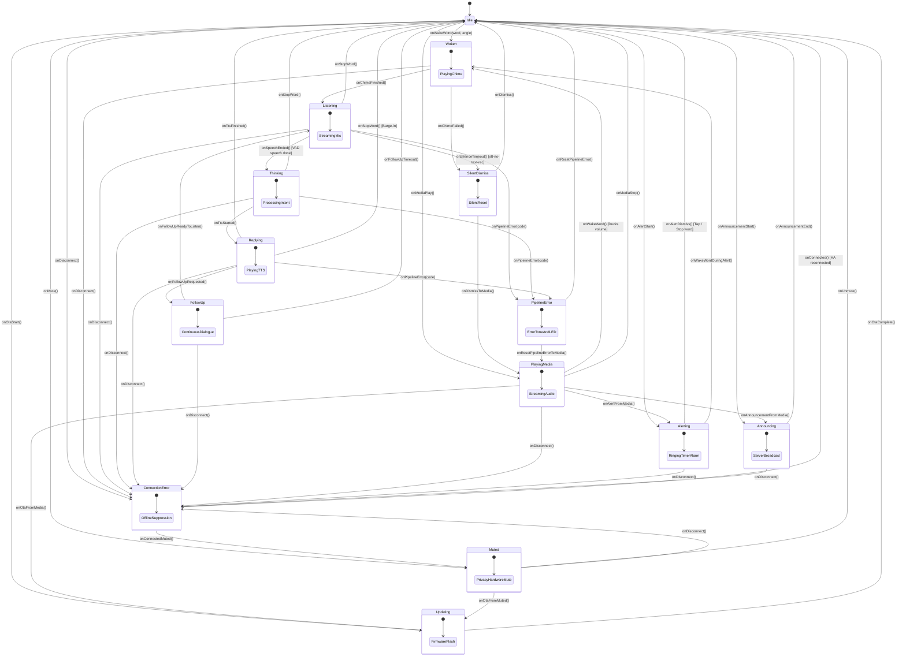

# esphome-satellite

[](https://github.com/axiomantic/esphome-satellite/actions/workflows/ci.yml)
[](https://opensource.org/licenses/MIT)

**`esphome-satellite`** is a compile-time verified voice satellite state machine for [ESPHome](https://esphome.io) devices (such as Seeed ReSpeaker XVF3800 and Home Assistant Voice PE), built on [`nim-esphome`](https://github.com/axiomantic/nim-esphome) and [`nim-typestates`](https://github.com/elijahr/nim-typestates).

It moves voice satellite state management directly onto the ESP32 microcontroller, eliminating split-brain race conditions between Home Assistant server events and device hardware callbacks while enforcing state invariants at compile time.

---

## Table of Contents

- [The Voice Satellite Race Condition Problem](#the-voice-satellite-race-condition-problem)
- [How Compile-Time Typestates Solve It](#how-compile-time-typestates-solve-it)
- [State Machine Architecture](#state-machine-architecture)
- [Granular Error Handling](#granular-error-handling)
- [Extended Lifecycle States](#extended-lifecycle-states)
- [Integration Guide for ESPHome](#integration-guide-for-esphome)
  - [Step 1: Include External Components](#step-1-include-external-components)
  - [Step 2: Add the C Bridge Header](#step-2-add-the-c-bridge-header)
  - [Step 3: Connect Voice Assistant & Extended Event Hooks](#step-3-connect-voice-assistant--extended-event-hooks)
  - [Step 4: (Alternative) Using the Drop-in Package](#step-4-alternative-using-the-drop-in-package)
- [Supported Hardware](#supported-hardware)
- [Local Host Testing](#local-host-testing)
- [Project Layout](#project-layout)
- [License](#license)

---

## The Voice Satellite Race Condition Problem

In conventional ESPHome voice satellites, state is distributed across asynchronous Home Assistant server events, network callbacks, and C++ lambdas. Under real-world acoustic and network conditions, this causes severe UX bugs:

1. **Stop Word Clobbering**: Ambient noise or TV audio false-triggers the `Stop` wake word when the satellite is already idle, causing confusing audio stops and state corruption.
2. **Premature Chime & VAD Clipping**: If the microphone opens while the wake chime is still playing, the VAD algorithm hears the satellite\x27s own speaker and immediately triggers `stt-no-text-recognized`.
3. **Double Wake / Rapid Re-triggering**: A wake word detected while already processing speech can corrupt audio buffers or cause duplicate requests.
4. **Offline Phantom Triggers**: On-device micro wake word models continuing to trigger while the WiFi or Home Assistant API connection is dropped.
5. **Ducking Clobbering**: Music streaming volume is not properly ducked or fails to un-duck when conversations finish or fail.

---

## How Compile-Time Typestates Solve It

With [`nim-typestates`](https://github.com/elijahr/nim-typestates), the state of the satellite is encoded directly in the Nim type system:

- **Strict Transitions**: You cannot call `onSpeechEnded()` on an `Idle` or a `Thinking` state. The compiler rejects it with a type mismatch error.
- **Barge-in Safety**: The `Stop` wake word is only valid during `Listening`, `Thinking`, `Replying`, or active `Alerting`. In `Idle`, `onStopWord()` does not exist on the type.
- **Strict Serialization**: Transitioning to `Listening` requires a completed chime event (`onChimeFinished()`). The microphone cannot capture audio during playback.
- **Offline Suppression**: When the satellite enters `ConnectionError`, wake word transitions are eliminated from the state type.
- **Privacy Enforcement**: When `Muted`, wake word detection and microphone capture cannot compile or execute.

---

## State Machine Architecture



---

## Granular Error Handling

Conventional voice implementations dump all failures into a generic error handler that plays loud error tones. `nim-esphome-satellite` partitions errors into three distinct typestates:

| Typestate | Typical Triggers | Satellite Behavior |
|---|---|---|
| **`SilentDismiss`** | Silence timeout (`stt-no-text-recognized`), duplicate wake word. | **Completely silent instant reset**. No error buzzer, no blinking red LEDs. Unlocks the audio beam, restores media if ducked, and returns cleanly to `Idle`. |
| **`PipelineError`** | Intent parsing error, TTS streaming network error, STT failure. | Plays the standard error sound, pulses red LEDs, unlocks the microphone beam, restores media if ducked, and resets safely to `Idle`. |
| **`ConnectionError`**| Home Assistant API disconnect, WiFi dropped. | Indicates offline status via LEDs. **Wake word triggers are rejected/suppressed** until reconnect. |

---

## Extended Lifecycle States

| State | Hook / Trigger | Behavior & Compile-Time Guarantees |
|---|---|---|
| **`Muted`** | `call_nim_set_muted(true)` | Privacy lock. Wake word detection and mic capture are statically disallowed on the type. |
| **`FollowUp`** | `call_nim_follow_up()` | Continuous conversation without requiring wake words between dialogue turns. |
| **`PlayingMedia`** | `call_nim_media_play()` | Background music / radio streaming. Audio ducks on wake word and auto-restores when dialogue ends. |
| **`Alerting`** | `call_nim_alert_start()` | Active timer / alarm buzzer. Interrupted via touch tap, stop word, or new command. |
| **`Announcing`** | `call_nim_announcement_start()` | Unprompted server broadcasts (intercom, doorbell, security announcements). |
| **`Updating`** | `call_nim_ota_start()` | Firmware flash in progress. All audio tasks and DSP inference are halted to prevent brownouts. |

---

## Integration Guide for ESPHome

### Step 1: Include External Components

In your ESPHome device configuration YAML:

```yaml
external_components:
  - source:
      type: git
      url: https://github.com/axiomantic/nim-esphome
    components: [nim]

nim:
  source: /path/to/nim-esphome-satellite/src/nim_esphome_satellite.nim
  nimble_paths:
    - /path/to/nim-typestates/src
```

### Step 2: Add the C Bridge Header

Include `nim_satellite_bridge.h` in your ESPHome `includes:` section:

```yaml
esphome:
  name: my-voice-satellite
  includes:
    - nim_satellite_bridge.h
```

> **Note**: All bridge functions use `__attribute__((weak))` and safe `call_nim_*` wrappers. If the Nim component is ever omitted or disabled, your firmware still compiles cleanly without linker errors.

### Step 3: Connect Voice Assistant & Extended Event Hooks

```yaml
# Wake Word Detection
micro_wake_word:
  on_wake_word_detected:
    - lambda: |-
        call_nim_wake_word(wake_word.c_str(), 0);

# Voice Assistant Pipeline
voice_assistant:
  on_start:
    - lambda: |-
        call_nim_chime_done(true);
  on_stt_vad_end:
    - lambda: |-
        call_nim_speech_ended();
  on_tts_start:
    - lambda: |-
        call_nim_tts_start();
  on_tts_end:
    - lambda: |-
        call_nim_tts_end();
  on_error:
    - lambda: |-
        call_nim_error(code.c_str());
  on_client_connected:
    - lambda: |-
        call_nim_connected();
  on_client_disconnected:
    - lambda: |-
        call_nim_disconnected();

# Hardware / Software Privacy Mute
switch:
  - platform: template
    id: mic_mute_switch
    name: "Mic Mute"
    on_turn_on:
      - lambda: |-
          call_nim_set_muted(true);
    on_turn_off:
      - lambda: |-
          call_nim_set_muted(false);

# Active Alarm / Timer Ringing
switch:
  - platform: template
    id: timer_ringing
    name: "Timer Ringing"
    on_turn_on:
      - lambda: |-
          call_nim_alert_start();
    on_turn_off:
      - lambda: |-
          call_nim_alert_stop();

# OTA Firmware Updates
ota:
  - platform: esphome
    on_begin:
      - lambda: |-
          call_nim_ota_start();
```

---

## Supported Hardware

- **Seeed Studio ReSpeaker XVF3800** (ESP32-S3 + XMOS XVF3800 DSP)
- **Home Assistant Voice PE** (ESP32-S3)
- **ESP32-S3-BOX / BOX-3**
- Any ESP32 / ESP32-S3 device running ESPHome Voice Assistant with `micro_wake_word`.

---

## Local Host Testing

You do not need an ESP32 connected to run the test suite. All state machine logic and compile-time invariants run locally on macOS or Linux:

```bash
# Run unit tests
./scripts/test.sh

# Or via Nim directly
nim c -r tests/test_fsm.nim
```

The test suite validates:
- **Core Happy Path**: `Idle -> Woken -> Listening -> Thinking -> Replying -> Idle`
- **Barge-in Interruptions**: `Stop` command during `Listening`, `Thinking`, `Replying`, and `Alerting`
- **Granular Errors**: `SilentDismiss`, `PipelineError`, `ConnectionError`
- **Extended Lifecycle**: `Muted`, `FollowUp`, `PlayingMedia`, `Alerting`, `Announcing`, `Updating`
- **Compile-Time Invariant Enforcement**: Verified using `not compiles(...)` (e.g. verifying that calling `onWakeWord` while `Muted` or `Updating` is rejected by the compiler).

---

## Project Layout

```
esphome-satellite/
├── src/
│   ├── nim_esphome_satellite.nim # 14-state verified FSM & exported C ABI
│   ├── satellite_fsm.nim         # Re-export entrypoint
│   └── nim_satellite_bridge.h    # C/C++ weak symbol bridge header
├── packages/
│   └── satellite_nim_fsm.yaml    # ESPHome reusable package for drop-in integration
├── tests/
│   └── test_fsm.nim              # 21 unit tests across 5 test suites
├── scripts/
│   ├── build.sh                  # Build validation script
│   └── test.sh                   # Unit test execution script
└── esphome_satellite.nimble      # Package specification & dependencies
```

---

## License

MIT © [Axiomantic](https://github.com/axiomantic) / [Elijah Rust](https://github.com/elijahr)
